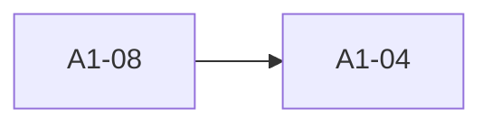
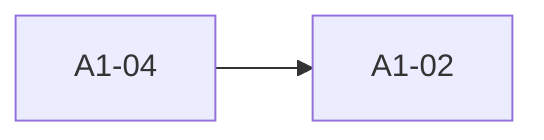

## Changelog




**Note:** `hany` reserved for **A2**.

---

## Link for BFI Scores
[BFI Scores](https://docs.google.com/spreadsheets/d/1Uk4wrC9y3BkQ29u4xVqS1DvKcs08W8fZ/edit?usp=sharing&ouid=117082670298483716297&rtpof=true&sd=true)
--- 

List of 
```mermaid
graph LR
A1 -- amir
A2 --> fahmi(rosak) -> ijat 
A3 --> malik
A4 --> hany(rosak) -> ijat(tertukar) -> faris
A5 --> aniff
A6 --> naufal
A7 --> syazwan
```
