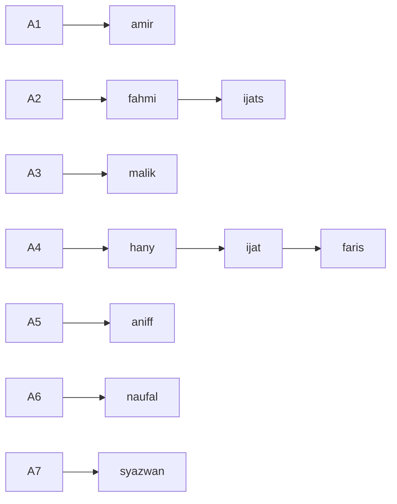

## Changelog


**Note:** `hany` reserved for **A2**.

---

## Link for BFI Scores
[BFI Scores](https://docs.google.com/spreadsheets/d/1Uk4wrC9y3BkQ29u4xVqS1DvKcs08W8fZ/edit?usp=sharing&ouid=117082670298483716297&rtpof=true&sd=true)
--- 

List of 


Run `get-raw-link.py` to easily get raw link from github to ease your analysis process 

Example output will be
```bash
https://raw.githubusercontent.com/6661647a77616e/Muse-Dataset/main/.gitignore
https://raw.githubusercontent.com/6661647a77616e/Muse-Dataset/main/A1-01/A1_01.txt
https://raw.githubusercontent.com/6661647a77616e/Muse-Dataset/main/A1-01/A1_01_EC.csv
https://raw.githubusercontent.com/6661647a77616e/Muse-Dataset/main/A1-01/A1_01_EO.csv
https://raw.githubusercontent.com/6661647a77616e/Muse-Dataset/main/A1-01/A1_01_Personality1.csv
https://raw.githubusercontent.com/6661647a77616e/Muse-Dataset/main/A1-01/A1_01_Personality2.csv
https://raw.githubusercontent.com/6661647a77616e/Muse-Dataset/main/A1-01/A1_01_Personality3.csv
https://raw.githubusercontent.com/6661647a77616e/Muse-Dataset/main/A1-02/A1_02_EC.csv
https://raw.githubusercontent.com/6661647a77616e/Muse-Dataset/main/A1-02/A1_02_EO.csv
https://raw.githubusercontent.com/6661647a77616e/Muse-Dataset/main/A1-02/A1_02_Personality1.csv
https://raw.githubusercontent.com/6661647a77616e/Muse-Dataset/main/A1-02/A1_02_Personality2.csv
https://raw.githubusercontent.com/6661647a77616e/Muse-Dataset/main/A1-02/A1_02_Personality3.csv
https://raw.githubusercontent.com/6661647a77616e/Muse-Dataset/main/A1-02/A1_02_duration.txt
https://raw.githubusercontent.com/6661647a77616e/Muse-Dataset/main/A1-03/A1_03_EC.csv
https://raw.githubusercontent.com/6661647a77616e/Muse-Dataset/main/A1-03/A1_03_EO.csv
https://raw.githubusercontent.com/6661647a77616e/Muse-Dataset/main/A1-03/A1_03_Personality1.csv
https://raw.githubusercontent.com/6661647a77616e/Muse-Dataset/main/A1-03/A1_03_Personality2.csv
https://raw.githubusercontent.com/6661647a77616e/Muse-Dataset/main/A1-03/A1_03_Personality3.csv
https://raw.githubusercontent.com/6661647a77616e/Muse-Dataset/main/A1-03/A1_03_duration.txt
https://raw.githubusercontent.com/6661647a77616e/Muse-Dataset/main/A1-04/A1_04_2_duration.txt
https://raw.githubusercontent.com/6661647a77616e/Muse-Dataset/main/A1-04/A1_04_2duration.txt
https://raw.githubusercontent.com/6661647a77616e/Muse-Dataset/main/A1-04/A1_04_3_Personality1.csv
https://raw.githubusercontent.com/6661647a77616e/Muse-Dataset/main/A1-04/A1_04_3_Personality2.csv
https://raw.githubusercontent.com/6661647a77616e/Muse-Dataset/main/A1-04/A1_04_3_Personality3.csv
```

## Star History

[](https://star-history.com/#6661647a77616e/Muse-Dataset&Timeline)
